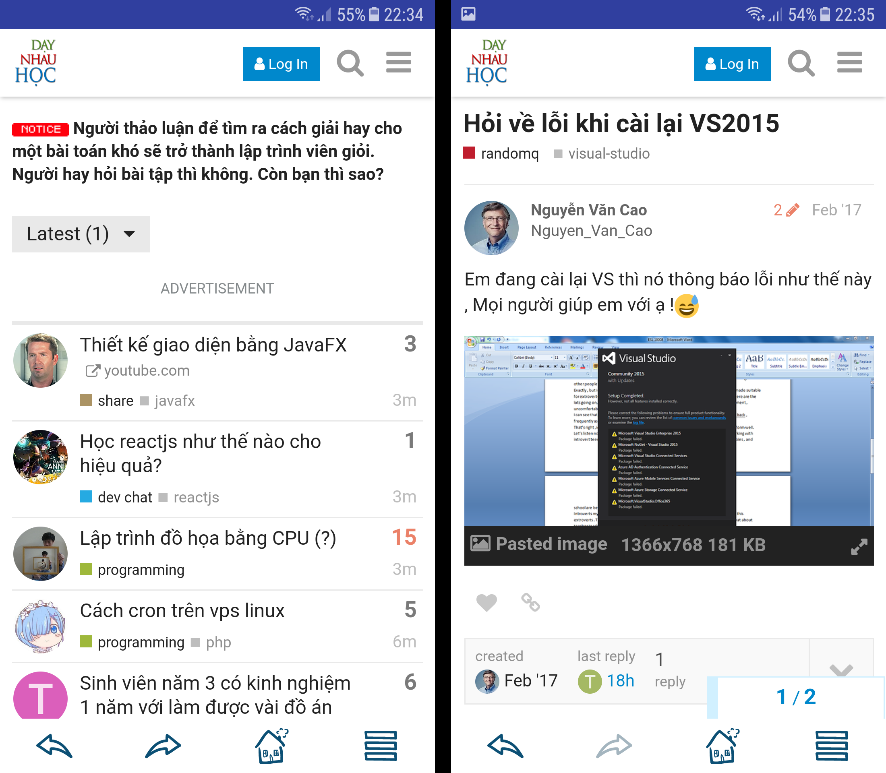

# Dạy Nhau Học

## Mô tả

Phiên bản diện thoại của diễn đàn Dạy Nhau Học.

Dạy Nhau Học là một forum mở. Ở đây, các bạn có thể thoải mái lập topic bàn luận, hỏi đáp thắc mắc. Các bạn có thể hỏi về đủ vấn đề từ kĩ thuật, bảo mật, ngôn ngữ lập trình cho tới hướng nghiệp, học tập.

Không chỉ vậy, Dạy Nhau Học còn có các thành viên rất năng nổ, nhiệt tình, sẵn sàng tận tình trả lời mọi câu hỏi của bạn. Lưu ý là mọi người ở đây không phải dân giải bài tập hộ, do đó các bạn đừng mang bài tập về nhà lên hỏi nhé.

Mình viết ứng dụng này để học thêm về Kotlin và Android, hi vọng các bạn sẽ yêu thích ứng dụng này.

## Ảnh màn hình

## Cài đặt

[Play Store: Dạy Nhau Học](https://play.google.com/store/apps/details?id=com.daugau.daynhauhoc)